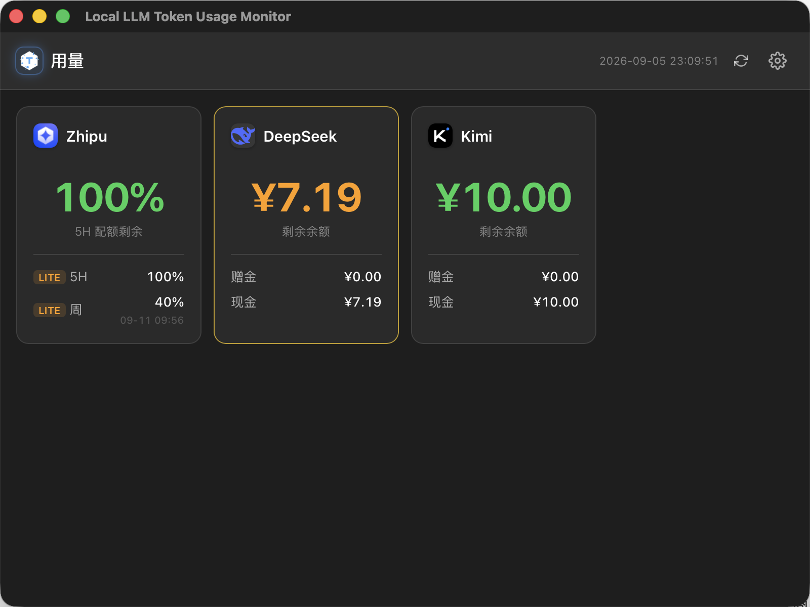

# Local LLM Token Usage Monitor Desktop

A lightweight desktop application for monitoring token usage and balances across multiple LLM providers. Built with Tauri, React, TypeScript, and Rust.


## Preview



## Features

- **Multi-Provider Support** — Monitor usage across multiple LLM platforms:
  - DeepSeek
  - Kimi (Moonshot)
  - Zhipu (GLM)
- **Real-Time Usage Tracking** — View token consumption and remaining balance at a glance
- **System Tray Integration** — Runs quietly in the background with a native tray icon
- **Auto-Start** — Optionally launch on system startup
- **Periodic Polling** — Automatically refreshes usage data on a configurable schedule
- **Low Resource Footprint** — Powered by Tauri's lightweight Rust backend

## Download

Head to [GitHub Releases](https://github.com/hajifish/Local-LLM-Token-Usage-Monitor-Desktop/releases) to download the latest version.

| Platform | Chip | Format |
|----------|------|--------|
| macOS | Apple Silicon (M1/M2/M3/M4) | `.dmg` |

> Intel-based Macs are not supported. If you need an Intel version, please build from source.

### macOS "App is Damaged" Warning on First Launch

Since the app is not signed or notarized by Apple, you may see a "app is damaged" or "cannot verify developer" warning when opening it for the first time. Here's how to resolve it:

1. Right-click the app icon and select "Open"
2. Click "Open" in the dialog that appears
3. Or go to "System Settings → Privacy & Security" and click "Open Anyway"

## Tech Stack

| Layer     | Technology                  |
|-----------|-----------------------------|
| Frontend  | React 18 + TypeScript       |
| Backend   | Rust (Tauri 2)              |
| Build     | Vite 6                      |
| Framework | Tauri 2                     |

## Development

### Prerequisites

- [Node.js](https://nodejs.org/) v18+
- [Rust](https://www.rust-lang.org/tools/install) stable toolchain
- [Tauri system dependencies](https://v2.tauri.app/start/prerequisites/)

### Quick Start

```bash
# 1. Clone the repository
git clone https://github.com/hajifish/Local-LLM-Token-Usage-Monitor-Desktop.git
cd Local-LLM-Token-Usage-Monitor-Desktop

# 2. Install frontend dependencies
npm install

# 3. Run in development mode (with hot reload)
npm run tauri dev
```

### Building for Production

```bash
npm run tauri build
```

Built artifacts will be located in `src-tauri/target/release/bundle/`.

### Contributing

Issues and Pull Requests are welcome. See [CONTRIBUTING.md](CONTRIBUTING.md) for details.

## Project Structure

```
├── src/                        # React frontend
│   ├── components/
│   │   ├── ErrorBoundary.tsx   # Error boundary component
│   │   ├── Settings.tsx        # Provider configuration page
│   │   └── UsagePanel.tsx      # Usage display panel
│   ├── hooks/
│   │   └── useUsage.ts         # Data fetching hook
│   ├── styles/
│   │   └── app.css             # Global styles (light theme)
│   └── App.tsx                 # Main application component
├── src-tauri/                  # Rust backend
│   ├── src/
│   │   ├── providers/          # LLM provider interfaces
│   │   │   ├── deepseek.rs     # DeepSeek
│   │   │   ├── kimi.rs         # Kimi (Moonshot)
│   │   │   ├── zhipu.rs        # Zhipu (GLM)
│   │   │   ├── openai.rs       # OpenAI
│   │   │   └── anthropic.rs    # Anthropic
│   │   ├── commands.rs         # Tauri command handlers
│   │   ├── config.rs           # Configuration management
│   │   ├── models.rs           # Data models
│   │   ├── scheduler.rs        # Background polling scheduler
│   │   └── tray.rs             # System tray
│   └── Cargo.toml
└── .github/workflows/          # CI/CD
    ├── build.yml               # Build verification
    └── release.yml             # Release workflow
```

## License

This project is open-sourced under the MIT License — see the [LICENSE](LICENSE) file for details.
